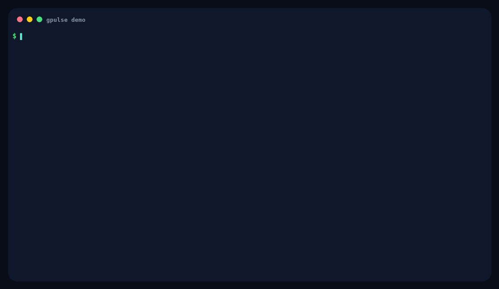

# GPulse

**GPulse** is a beautiful, dependency-light terminal dashboard for **any SSH-accessible NVIDIA GPU server**.
It auto-detects GPU model, GPU count, VRAM, temperature, power limits, utilization, trends, and active GPU jobs from `nvidia-smi`.



> The demo GIF uses synthetic data so public docs do not leak real PIDs, usernames, project paths, or training commands.

---

## Why GPulse?

`watch nvidia-smi` is useful, but it is not pleasant to stare at all day.
GPulse gives your GPU server a live pulse: utilization bars, VRAM pressure, temperature, power draw, trends, and active jobs in one smooth terminal view.

- **Works with any NVIDIA GPU box** that has `nvidia-smi` and `python3`
- **No remote install required**: the local wrapper streams the dashboard over SSH
- **Survives laptop sleep / broken SSH sessions** with the tmux launcher
- **Shows more than `watch nvidia-smi`**: trends, bars, GPU jobs, users, cwd, commands
- **Zero Python package dependencies**: standard library only
- **Friendly across macOS, Linux, and Windows WSL**

---

## What it shows

- Per-GPU utilization, VRAM, temperature, power draw, and trend sparkline
- Active GPU processes with PID, GPU, VRAM, user, runtime, working directory, and command
- Auto-sized layout that fills the current terminal width
- Smooth 8 FPS rendering with background sampling
- Unicode UI by default, ASCII fallback when needed

---

## Project layout

| File | Purpose |
|---|---|
| `gpulse-local` | Local GPU dashboard executable. |
| `gpulse-ssh` | Quick remote dashboard over SSH. |
| `gpulse` | Persistent tmux-backed remote dashboard with reconnect loop. |
| `gpu_dashboard.py` | Dashboard implementation. Runs on the GPU machine and reads `nvidia-smi`. |
| `ssh_gpu_dashboard.sh` | Streams `gpu_dashboard.py` to a remote host over SSH and runs it there. |
| `start_ssh_gpu_tmux.sh` | Generic tmux launcher with reconnect loop for any SSH host. |
| `assets/gpulse-demo.gif` | Public README demo GIF. |
| `assets/make_gpulse_demo_gif.py` | Regenerates the demo GIF using synthetic data. |

Runtime shape:

```text
your terminal
  ├─ gpulse-local             # local GPU dashboard
  ├─ gpulse-ssh <host>        # quick remote dashboard over SSH
  └─ gpulse <host>            # tmux + SSH + auto reconnect
        └─ ssh <host>
             └─ python3 gpu_dashboard.py
                  ├─ nvidia-smi
                  └─ ps
```

---

## Requirements

### Local machine

| Platform | Status | Required tools |
|---|---:|---|
| macOS | ✅ supported | `ssh`, `python3`, `tmux` |
| Linux | ✅ supported | `ssh`, `python3`, `tmux` |
| Windows WSL2 | ✅ recommended | `openssh-client`, `python3`, `tmux` inside WSL |
| Native PowerShell | ⚠️ not the primary target | Use WSL for the best experience |

### GPU server

- Linux NVIDIA GPU server
- `nvidia-smi`
- `python3`
- `ps` for process/user/cwd/command details

Your local laptop does **not** need an NVIDIA GPU when using `gpulse-ssh` or `gpulse`; GPU data is collected on the remote server.

---

## Installation

### Option A: clone and symlink

```bash
git clone https://github.com/daehwa00/gpulse.git ~/Projects/gpulse
cd ~/Projects/gpulse
chmod +x gpulse gpulse-ssh gpulse-local gpu_dashboard.py ssh_gpu_dashboard.sh start_ssh_gpu_tmux.sh

mkdir -p ~/.local/bin
ln -sf ~/Projects/gpulse/gpulse ~/.local/bin/gpulse
ln -sf ~/Projects/gpulse/gpulse-ssh ~/.local/bin/gpulse-ssh
ln -sf ~/Projects/gpulse/gpulse-local ~/.local/bin/gpulse-local
```

Make sure `~/.local/bin` is in your `PATH`.

### Option B: shell aliases

Add this to `~/.zshrc` or `~/.bashrc`:

```bash
alias gpulse="$HOME/Projects/gpulse/gpulse"
alias gpulse-ssh="$HOME/Projects/gpulse/gpulse-ssh"
alias gpulse-local="$HOME/Projects/gpulse/gpulse-local"
```

Reload your shell:

```bash
source ~/.zshrc   # zsh
# or
source ~/.bashrc  # bash
```

### Configure SSH hosts

Create short host names in `~/.ssh/config`:

```sshconfig
Host gpu01
  HostName gpu01.example.com
  User your-user
  Port 22
  ServerAliveInterval 10
  ServerAliveCountMax 2

Host gpu02
  HostName 10.0.0.22
  User your-user
  Port 22
```

Test the remote host:

```bash
ssh gpu01 nvidia-smi
```

---

## Quick start

### Local GPU machine

If you are already logged into a GPU server:

```bash
gpulse-local
```

### Quick remote view

```bash
gpulse-ssh gpu01
```

Also works with direct SSH targets:

```bash
gpulse-ssh user@gpu-server
gpulse-ssh gpu02 --max-jobs 16
```

This exits when the terminal closes. For long-running monitoring, use `gpulse`.

### Persistent remote dashboard

```bash
gpulse gpu01
```

`gpulse` creates a local tmux session and runs the SSH dashboard inside it.
If you close the terminal, the tmux session stays alive. Run the same command again to reattach:

```bash
gpulse gpu01
```

Use a custom tmux session name:

```bash
GPU_TMUX_SESSION=mygpu gpulse gpu01
```

Use fallback hosts or routes:

```bash
GPU_TMUX_SESSION=labgpu GPU_TMUX_HOSTS="gpu01 gpu01-vpn gpu01-bastion" gpulse
```

Monitor several GPU servers independently:

```bash
GPU_TMUX_SESSION=gpu01 gpulse gpu01
GPU_TMUX_SESSION=gpu02 gpulse gpu02
GPU_TMUX_SESSION=gpu03 gpulse gpu03
```

---

## CLI options

Options can be passed to `gpulse-local`, `gpulse-ssh`, and `gpulse`:

```bash
gpulse gpu01 --max-jobs 20 --sample-interval 1.5
gpulse-ssh gpu02 --ascii --bar-width 18
```

| Option | Default | Description |
|---|---:|---|
| `--sample-interval` | `1.0` | Seconds between `nvidia-smi` samples. Must be greater than 0. |
| `--frame-interval` | `0.125` | Render interval. `0.125` is about 8 FPS. Must be greater than 0. |
| `--smoothing` | `0.32` | Smooths visual value changes. Must be between `0.01` and `1.0`. |
| `--bar-width` | `24` | Base width for utilization bars. Must be greater than 0; layout can grow/shrink dynamically. |
| `--max-jobs` | `10` | Maximum number of GPU jobs to show. Must be greater than 0; use `--no-jobs` to hide jobs. |
| `--history-len` | `24` | Sparkline history length. Must be greater than 0. |
| `--job-interval` | `3.0` | Seconds between job/process refreshes. Must be greater than 0. |
| `--no-jobs` | off | Hide the active jobs table. |
| `--ascii` | off | Use ASCII characters for older terminals. |

---

## Environment variables

Use these for one-off customization:

```bash
GPU_DASH_MAX_JOBS=20 GPU_DASH_FRAME_INTERVAL=0.2 gpulse gpu01
```

| Environment variable | Description |
|---|---|
| `GPU_DASH_SAMPLE_INTERVAL` | GPU sampling interval. |
| `GPU_DASH_FRAME_INTERVAL` | Screen render interval. |
| `GPU_DASH_SMOOTHING` | Visual smoothing factor. |
| `GPU_DASH_BAR_WIDTH` | Base bar width. |
| `GPU_DASH_MAX_JOBS` | Number of jobs to display. |
| `GPU_DASH_HISTORY_LEN` | Sparkline history length. |
| `GPU_DASH_JOB_INTERVAL` | Job table refresh interval. |
| `GPU_DASH_NO_JOBS=1` | Disable the job table. |
| `GPU_DASH_ASCII=1` | Force ASCII UI. |
| `GPU_DASH_SSH_OPTS` | Whitespace-separated SSH options used by `gpulse-ssh`. |
| `GPU_TMUX_SESSION` | tmux session name used by `gpulse`. |
| `GPU_TMUX_HOSTS` | Space-separated fallback hosts for `gpulse`. |
| `GPU_TMUX_SSH_OPTS` | Whitespace-separated SSH options used by `gpulse`. |

---

## Windows users

The best Windows setup is **Windows Terminal + WSL2 Ubuntu**:

```bash
sudo apt update
sudo apt install -y openssh-client tmux python3
```

Then install and use GPulse inside WSL exactly like Linux.
Native PowerShell support is not the primary target because the launcher relies on bash, tmux, SSH, and Unix process tools.

---

## Generate the demo GIF

The README GIF is generated with ImageMagick:

```bash
python3 ~/Projects/gpulse/assets/make_gpulse_demo_gif.py
```

Install ImageMagick:

```bash
brew install imagemagick       # macOS
sudo apt install imagemagick   # Ubuntu/Debian
```

The generated GIF intentionally uses synthetic data. If you record a real dashboard, check that usernames, paths, PIDs, and commands are safe to publish.

---

## Troubleshooting

| Problem | Fix |
|---|---|
| `nvidia-smi not found` | Install/check NVIDIA drivers on the GPU server. |
| `python3 not found` | Install `python3` on the GPU server. |
| `tmux not found` | Install `tmux` locally, or use `gpulse-ssh` without tmux. |
| `Run this from a normal shell` | Start `gpulse` outside an existing tmux session. |
| Unicode blocks look broken | Use `--ascii` or `GPU_DASH_ASCII=1`. |
| Columns look misaligned | Use a monospace terminal font and make the terminal wider. |
| Updates feel too fast | Try `GPU_DASH_FRAME_INTERVAL=0.2` or `--sample-interval 2`. |
| Job table is empty | Wait a few seconds; some drivers/permissions limit compute-app visibility. |
| SSH disconnects often | Tune `ServerAliveInterval`, `ServerAliveCountMax`, and `ConnectTimeout`. |
| Closing the terminal kills the view | Use `gpulse` instead of `gpulse-ssh`. |

---

## Stop and reattach

Stop the dashboard process:

```text
Ctrl-C
```

`gpulse` has an auto-reconnect loop, so to stop it completely, kill the tmux session.
The default session name is `gpu-<host>`:

```bash
tmux kill-session -t gpu-gpu01
```

If you used a custom session name:

```bash
tmux kill-session -t mygpu
```

Reattach later:

```bash
gpulse gpu01
```

---

## Uninstall

```bash
rm -rf ~/Projects/gpulse
rm -f ~/.local/bin/gpulse ~/.local/bin/gpulse-ssh ~/.local/bin/gpulse-local
rm -f ~/.scripts/gpu_dashboard.py \
  ~/.scripts/ssh_gpu_dashboard.sh \
  ~/.scripts/start_ssh_gpu_tmux.sh \
  ~/.scripts/assets
```

Then remove any GPulse alias lines from `~/.zshrc` or `~/.bashrc`.

---

## Command summary

```bash
gpulse-local          # local GPU dashboard
gpulse-ssh gpu01      # quick remote dashboard
gpulse gpu01          # persistent tmux-backed remote dashboard
gpulse <ssh-host>     # any SSH-accessible GPU server
```
